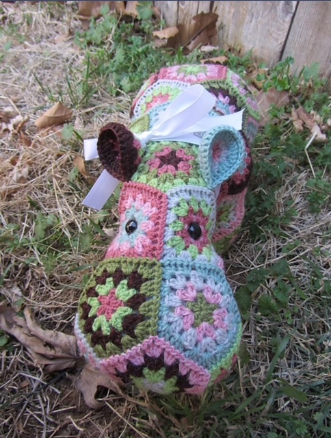
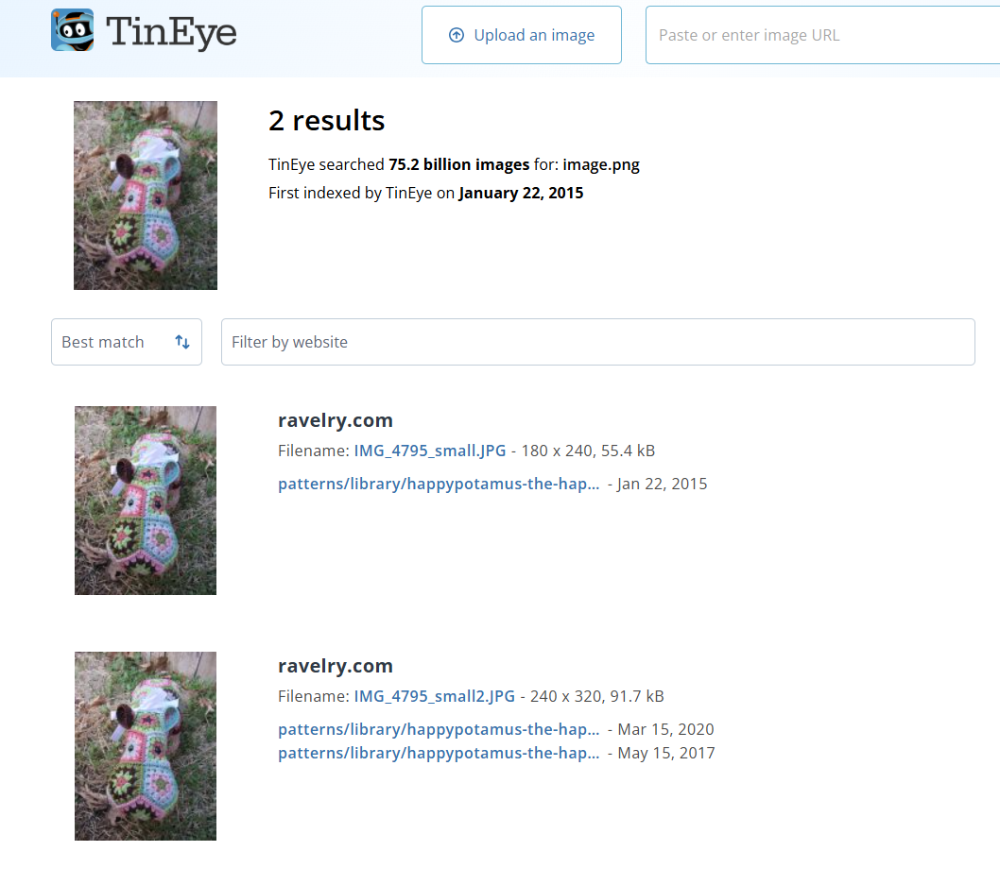
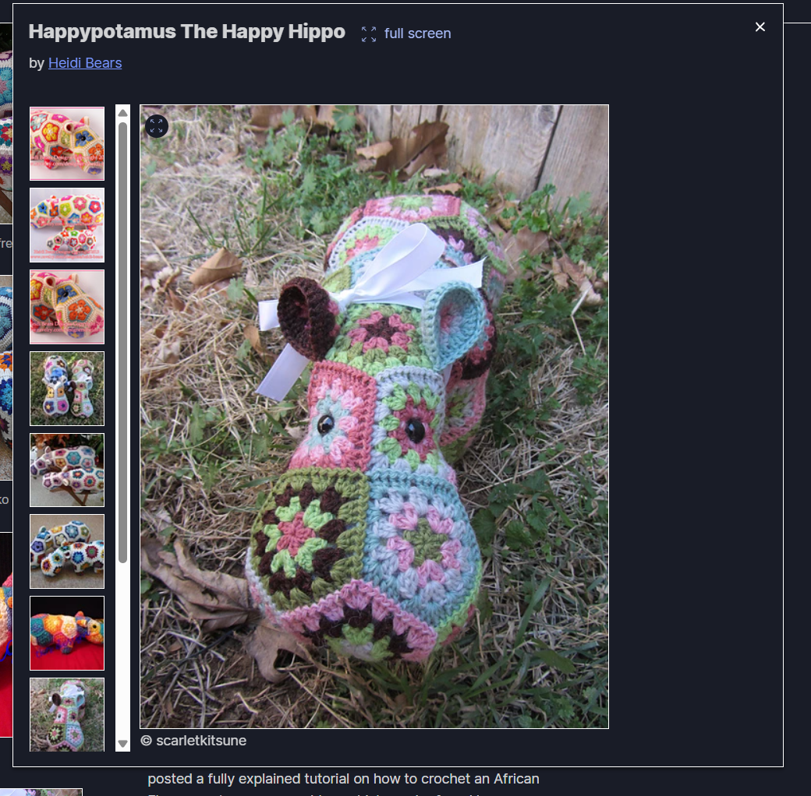
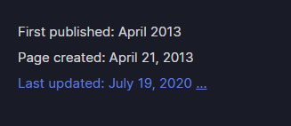
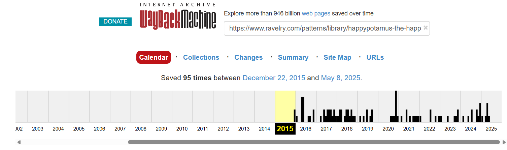

# CTF Writeups

Welcome! This page showcases the Capture the Flag (CTF) competitions and cybersecurity challenges I've participated in.

---

<!--
# National Cyber League Spring 2025 CTF


I competed with six other SANS classmates in the NCL Spring 2025 Team Game, placing **63rd out of 4,798 teams nationwide**, ranking within the **top 1.3% of all competitors**. The CTF ran from Friday, April 25 through Sunday, April 27.

Throughout the event, I gained hands-on experience across several cybersecurity domains, including log analysis, network scanning and reconnaissance, network traffic analysis, password cracking, and more. I was able to apply many of the techniques I learned from SEC401 (GSEC) and SEC504 (GCIH).

---

## Several key techniques and areas I focused on during this CTF were:

### YARA Rule Development:

I wrote custom YARA rules to identify malware-infected files by detecting XOR decryption routines and other malicious attributes.

---

### Advanced Nmap Scanning:

I researched and executed a variety of Nmap scans to discover services running on non-standard ports and evade firewall detection, including:

- **Source Port Manipulation with Decoy Techniques:**
nmap -sS -PN -g 80 -D RND:10 -T2

- **Packet Fragmentation and MAC Spoofing:**
nmap -sS -T2 -f -g 53 --spoof-mac 0

- **FIN and ACK Scan Techniques:**
nmap -sF nmap -sA


Fyodor’s book, *NMAP Network Scanning*, was invaluable in creating the Nmap scans.

---

### Network Traffic Analysis and File Reconstruction:

I improved my Wireshark and TShark skills by solving network traffic analysis challenges, including analyzing `.pcap` files to:

- Apply protocol-specific filters to isolate pgsql traffic streams.
- Identify large Data Row responses.
- Reconstruct full application-layer payloads using Follow TCP Stream analysis.

Chris Sanders’ book, *Practical Packet Analysis*, was a great resource.

---

### Manual Artifact Extraction and Recovery:

I recovered embedded files to solve this challenge by:

- Extracting raw hex-encoded payloads from network traffic.
- Normalizing data by removing `\x` escape sequences using `sed`.
- Rebuilding binary files using `xxd` to discover the password that unlocked a protected archive.

---

# The “Happypotamus” OSINT Challenge

This NCL OSINT challenge provided the below picture and asked a series of questions, starting with where you can buy this item. Follow-up questions asked you to identify the crochet pattern, who created the pattern, the item’s price, and when it first went on sale.



## Solution Methodology

### (1) Reverse Image Search

I uploaded the image to [TinEye](https://tineye.com/), which is a reverse image search website. TinEye showed the following results:



I followed the first URL to [Ravelry](https://www.ravelry.com/patterns/library/happypotamus-the-happy-hippo), which is a website that allows users to sell crochet patterns. This URL brought me to Heidi Bears’ **“Happypotamus The Happy Hippo”** crochet pattern, where I found the matching image:



Other popular reverse image search sites include:

- [Google Images](https://images.google.com)
- [Bing Visual Search](https://www.bing.com/visualsearch)
- [Yandex Images](https://yandex.com/images)

### (2) The Crochet Pattern & Its Creators

The next portion of the challenge asked you to identify the Happypotamus’s crochet pattern and its creators. I solved this by carefully reading the Ravelry webpage and its linked pages. These pages revealed that the Happypotamus pattern uses an **African Flower hexagon motif pattern**.

The Ravelry site linked to a blog post identifying **Lounette Fourie** and **Anita Roussouw** as the African Flower hexagon pattern’s creators. I verified this on multiple websites using the following Google Dork search:

```text
"African Flower" AND hexagon AND ("Lounette Fourie" OR "Anita Roussouw")
```

### (3) Original Sales Date

A tricky question asked when the Happypotamus was first listed for sale. I first reviewed the Ravelry Happypotamus website and saw that the webpage was created and first published in **April 2013**.



I next checked the [Wayback Machine](https://archive.org) and entered the Happypotamus URL, but the first snapshot of the webpage was from **2015**.



Although I couldn’t find a definitive source stating when the item was first listed for sale, the correct answer was **April 21, 2013** (the webpage creation date).

---

This OSINT question provided a fun reverse image and information search challenge. I look forward to applying many of the techniques I learned from this CTF in my home lab.
