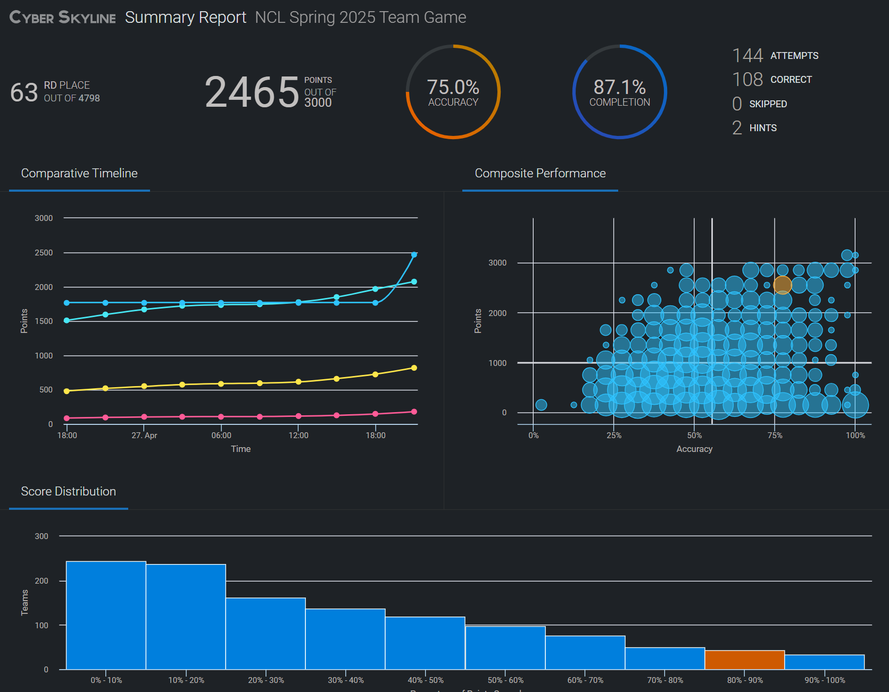

# CTF Writeups

Welcome! This page showcases the Capture the Flag (CTF) competitions and cybersecurity challenges I've participated in.

---

# National Cyber League Spring 2025 CTF

I competed with six other SANS classmates in the NCL Spring 2025 Team Game, placing **63rd out of 4,798 teams nationwide**, ranking within the **top 1.3% of all competitors**. The CTF ran from Friday, April 25 through Sunday, April 27.

Throughout the event, I gained hands-on experience across several cybersecurity domains, including log analysis, network scanning and reconnaissance, network traffic analysis, password cracking, and more. I was able to apply many of the techniques I learned from SEC401 (GSEC) and SEC504 (GCIH).

---

## Several key techniques and areas I focused on during this CTF were:

### YARA Rule Development:

I wrote custom YARA rules to identify malware-infected files by detecting XOR decryption routines and other malicious attributes.

---

### Advanced Nmap Scanning:

I researched and executed a variety of Nmap scans to discover services running on non-standard ports and evade firewall detection, including:

- **Source Port Manipulation with Decoy Techniques:**
nmap -sS -PN -g 80 -D RND:10 -T2

- **Packet Fragmentation and MAC Spoofing:**
nmap -sS -T2 -f -g 53 --spoof-mac 0

- **FIN and ACK Scan Techniques:**
nmap -sF nmap -sA

Fyodor’s book, *NMAP Network Scanning*, was invaluable in creating the Nmap scans.

---

### Network Traffic Analysis and File Reconstruction:

I improved my Wireshark and TShark skills by solving network traffic analysis challenges, including analyzing `.pcap` files to:

- Apply protocol-specific filters to isolate pgsql traffic streams.
- Identify large Data Row responses.
- Reconstruct full application-layer payloads using Follow TCP Stream analysis.

Chris Sanders’ book, *Practical Packet Analysis*, was a great resource.

---

### Manual Artifact Extraction and Recovery:

I recovered embedded files to solve this challenge by:

- Extracting raw hex-encoded payloads from network traffic.
- Normalizing data by removing `\x` escape sequences using `sed`.
- Rebuilding binary files using `xxd` to discover the password that unlocked a protected archive.

---

I look forward to applying these and other techniques in my home lab.
